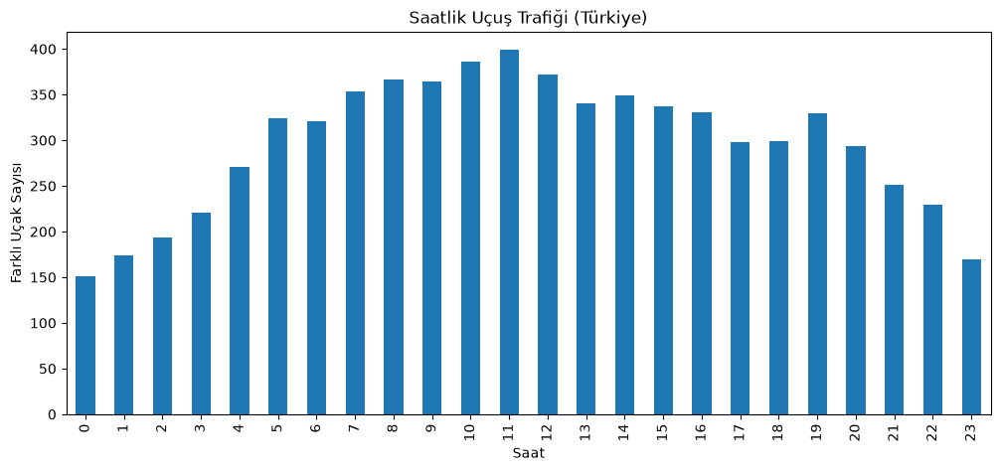
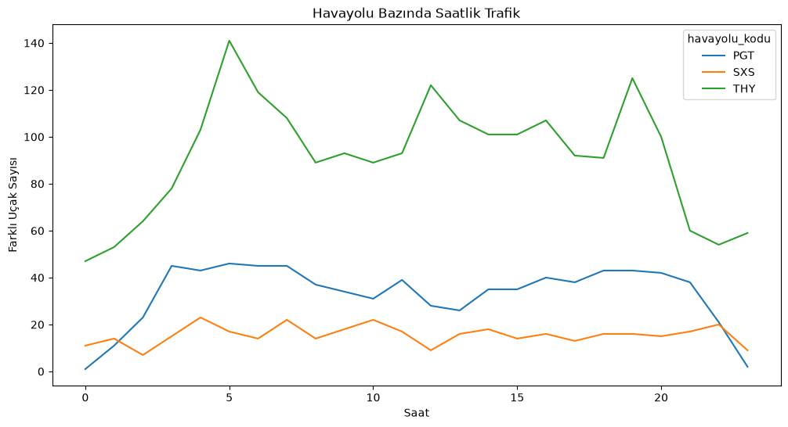
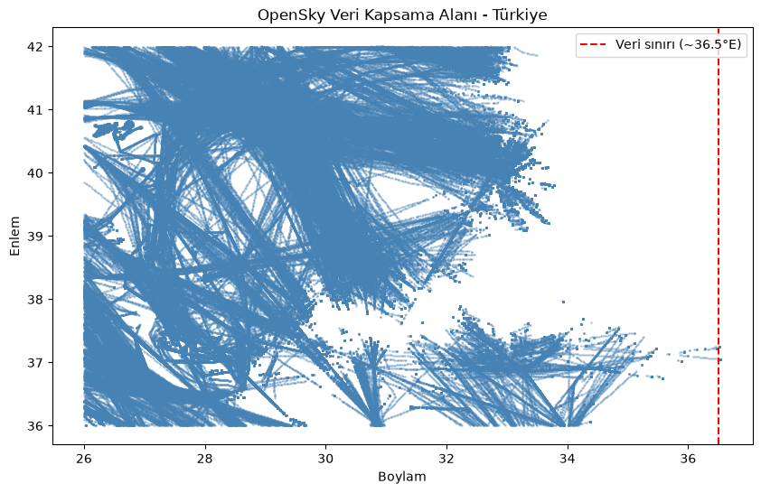

*[Türkçe versiyon](README.md)*

# Turkish Airspace Flight Traffic Analysis

A data analysis project examining flight traffic over Turkish airspace using OpenSky Network data. I'm a first-year Data Science and Analytics student at Atatürk University, and this is the first independent project I built as part of my studies — designed to give me hands-on, end-to-end experience with live APIs, authentication, data cleaning, and visualization.

## Project Goals

- Identify which hours of the day see the busiest/quietest traffic over Turkish airspace
- Compare the operational traffic patterns of different airlines (Turkish Airlines, Pegasus, SunExpress)
- Assess the geographic coverage limits and reliability of the collected data

## Data Used

Full state vector data for one day (24 hourly files) from OpenSky Network's ["Weekly 24 Hours of State Vector Data"](https://opensky-network.org/data/scientific) dataset, filtered to a bounding box covering Turkish airspace (latitude 36-42°, longitude 26-45°).

- **Raw data:** ~61 million rows (worldwide)
- **Filtered data:** 897,996 rows (Turkey region)
- **Columns:** timestamp, aircraft identifier (icao24), callsign, position (lat/lon), altitude, velocity, heading, transponder code (squawk), and other technical fields

## Method

1. **Data collection:** Tried both OpenSky's live REST API (with OAuth2 authentication) and the pre-packaged weekly archive; the archive was chosen for more complete and consistent results.
2. **Cleaning:** Converted timestamps to a readable format, filtered out aircraft on the ground, dropped unnecessary technical columns (sensors, spi).
3. **Analysis:** Hourly grouping, airline-level breakdown (via callsign prefix), geographic distribution review, emergency signal (squawk code) scan.
4. **Visualization:** Interactive maps with Folium, hourly/airline charts with Matplotlib.

## Findings

### 1. Hourly Traffic Density
Traffic is lowest after midnight (00:00-04:00), rises sharply starting at 05:00, and **peaks at 11:00** (399 distinct aircraft). A second, smaller increase is observed around 19:00 in the evening.

### 2. Distinct Operational Models by Airline
- **Turkish Airlines (THY):** Shows a clear "wave" pattern — sharp peaks at 05:00 and 19:00, consistent with an Istanbul-centered hub-and-spoke operating model.
- **Pegasus (PGT):** Stays relatively steady throughout the day within a narrow band (25-46 aircraft), pointing to a point-to-point network structure.
- **SunExpress (SXS):** The lowest-volume carrier but also fairly steady, reflecting a regional profile centered around İzmir/Antalya.

### 3. Geographic Coverage Limits
Data is dense over the western half of Turkey (Istanbul, the Aegean, the western Mediterranean coast) and thins out moving east, with **almost no data beyond roughly 36.5°E longitude.** This boundary isn't symmetric — coverage along the southern coast (around Adana-Mersin) extends a bit further east than in the north. This reflects the geographic distribution of OpenSky's volunteer ADS-B receiver network rather than an actual absence of traffic in eastern Anatolia — it simply means there aren't enough receiver stations in that region. The distinct lines visible in the visualization trace the country's main air traffic corridors.

### 4. Anomaly Check
A scan for emergency squawk codes (7500/7600/7700) was performed; no emergency signals were found in the one day of data examined — an expected result given the sample size and the statistical rarity of such events.

## Limitations

- The analysis covers **a single day** (a Monday); no generalizations can be made about seasonal or weekly patterns.
- Because the data depends on OpenSky's volunteer receiver network, coverage in eastern Anatolia is weak to nonexistent.
- The `origin_country` field indicates an aircraft's country of registration, not its country of departure.

## Tools Used

Python, pandas, Matplotlib, Folium · Google Colab & VS Code (Jupyter) · OpenSky Network API/data archive

## Ideas for Further Development

- Add data from an additional day to compare weekday vs. weekend traffic
- Merge with an aircraft metadata database to break down traffic by aircraft type
- Move to a multi-month time series analysis if OpenSky Trino access is approved

## Related Resources

Some resources I consulted/drew on while building this project:

- [OpenSky Network](https://opensky-network.org/) — the project's core data source

## About

**Ömer Bolat**
Data Science and Analytics Student, Atatürk University

While building this project I ran into real-world problems — connectivity/authentication issues with OpenSky's live API, switching between platforms (Google Colab, Kaggle, VS Code), and handling large-scale data — and worked through each of them step by step.

- LinkedIn: [linkedin.com/in/ömer-bolat](https://www.linkedin.com/in/ömer-bolat-604b1932b/)
- GitHub: [https://github.com/omer-bolat](https://github.com/omer-bolat)
- Kaggle: [https://www.kaggle.com/bolatomer](https://www.kaggle.com/bolatomer)
